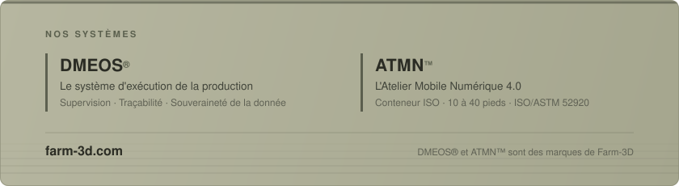

 

Farm-3D conçoit et opère des ateliers de fabrication additive grand format —
des unités mobiles autonomes, installées sur site, qui produisent au plus près
du besoin plutôt qu'à l'autre bout d'une chaîne logistique.

Nos machines travaillent en atelier comme en extérieur, par tous les temps.

 

Atelier Mobile Numérique 4.0 — en fonctionnement sur chantier

 

